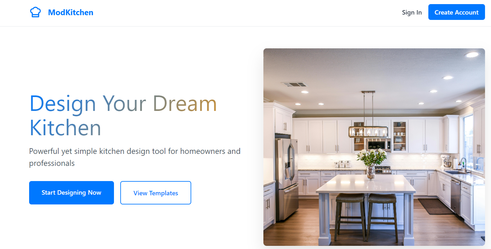

# Kitchen Design Tool



## 🏠 Live Demo

Explore the live application at [kitchen-design-tool.netlify.app](https://kitchen-design-tool.netlify.app/)

## 📋 Overview

Kitchen Design Tool is a comprehensive web application that helps homeowners, designers, and retailers visualize, plan, and configure kitchen spaces. The tool features an intuitive interface for designing kitchens with real-time 3D previews, material selection, and pricing calculations.

## ✨ Key Features

### User Management
- Multi-role authentication (homeowner, designer, retailer)
- User registration and login
- Password reset functionality
- Guest access options

### Project Management
- Save and load kitchen design projects
- Dashboard view of all projects
- Project deletion and editing

### Kitchen Design
- Interactive design canvas
- Cabinet library with various cabinet types
- Material selection for cabinet surfaces
- Hardware options for customization

### Visualization
- Real-time 3D preview of kitchen design
- Different viewpoints and perspectives
- Material and texture visualization

### Pricing & Planning
- Dynamic pricing based on selected components
- Cost breakdown by categories
- Budget planning features

### Marketing Pages
- Comprehensive features page
- Pricing plans with monthly/annual options
- Responsive landing page

## 🛠️ Technology Stack

### Frontend
- **Framework**: React 18 with TypeScript 5.0
- **Build Tool**: Vite 5.4 (for fast HMR and optimized production builds)
- **Styling**: CSS modules with Tailwind CSS 3.3
  - Custom design system with consistent color palette and spacing
  - Responsive design using Tailwind's breakpoint system
  - CSS variables for theme customization
- **Icons**: Lucide React (lightweight SVG icons with tree-shaking)
- **Routing**: React Router v6
  - Protected routes with authentication guards
  - Route-based code splitting for performance optimization

### Backend & Data
- **Database**: Supabase PostgreSQL
  - Row-Level Security (RLS) policies for data protection
  - Relational schema with foreign key constraints
  - JSON data types for flexible storage of kitchen configurations
- **Authentication**: Supabase Auth
  - JWT-based authentication with secure refresh tokens
  - Role-based access control (homeowner, designer, retailer)
  - Email confirmation and password reset flows
- **Storage**: Supabase Storage
  - S3-compatible object storage for project thumbnails
  - Public and private bucket policies
- **APIs**: Supabase JavaScript Client
  - Real-time listeners for collaborative features
  - Optimistic UI updates with error handling
  - Type-safe queries with TypeScript integration

### Deployment
- **Hosting**: Netlify
  - Edge CDN for global content delivery
  - Automatic HTTPS with Let's Encrypt
  - Serverless functions for backend processing
- **CI/CD**: Automatic deployment via Git
  - Preview deployments for pull requests
  - Environment variable management
  - Build cache optimization

## 🚀 Getting Started

### Prerequisites
- Node.js (v18.x or higher)
- npm or yarn
- Supabase account

### Installation

1. Clone the repository
   ```bash
   git clone https://github.com/samansalari/Kitchen-Design-Tool.git
   cd Kitchen-Design-Tool
   ```

2. Install dependencies
   ```bash
   npm install
   ```

3. Set up environment variables
   - Create a `.env` file in the root directory based on `.env.example`
   ```bash
   cp .env.example .env
   ```
   - Fill in your Supabase URL and anon key

4. Start the development server
   ```bash
   npm run dev
   ```

5. Open your browser and navigate to `http://localhost:5173`

## 📂 Project Structure

```
/
├── public/              # Static files
├── src/
│   ├── components/      # Reusable React components
│   │   ├── auth/        # Authentication components
│   │   ├── common/      # Shared components
│   │   ├── configurator/# Kitchen configurator components
│   │   ├── layout/      # Layout components
│   │   └── projects/    # Project management components
│   ├── contexts/        # React context providers
│   ├── data/            # Static data (cabinets, materials, etc.)
│   ├── lib/             # Utility libraries
│   ├── pages/           # Page components
│   ├── styles/          # CSS styles
│   ├── types/           # TypeScript type definitions
│   ├── App.tsx          # Main application component
│   └── main.tsx         # Application entry point
├── supabase/            # Supabase migrations and configurations
├── .env.example         # Example environment variables
├── netlify.toml         # Netlify configuration
└── package.json         # Project dependencies
```

## 🔐 Authentication & Database Setup

The application uses Supabase for authentication and database storage. To set up the database schema, run the following SQL commands in your Supabase SQL editor:

```sql
-- Enable Row Level Security
ALTER TABLE public.users ENABLE ROW LEVEL SECURITY;

-- Create user profiles table
CREATE TABLE IF NOT EXISTS public.users (
  id UUID PRIMARY KEY REFERENCES auth.users(id) ON DELETE CASCADE,
  full_name TEXT,
  role TEXT CHECK (role IN ('homeowner', 'designer', 'retailer')),
  created_at TIMESTAMPTZ DEFAULT now(),
  updated_at TIMESTAMPTZ DEFAULT now()
);

-- Create projects table
CREATE TABLE IF NOT EXISTS public.projects (
  id UUID PRIMARY KEY DEFAULT uuid_generate_v4(),
  user_id UUID REFERENCES auth.users(id) ON DELETE CASCADE,
  name TEXT NOT NULL,
  configuration JSONB NOT NULL,
  thumbnail_url TEXT,
  created_at TIMESTAMPTZ DEFAULT now(),
  updated_at TIMESTAMPTZ DEFAULT now()
);

-- Create security policies
CREATE POLICY "Users can insert their own profile" ON public.users FOR INSERT TO authenticated WITH CHECK (auth.uid() = id);
CREATE POLICY "Users can view their own profile" ON public.users FOR SELECT TO authenticated USING (auth.uid() = id);
CREATE POLICY "Users can update their own profile" ON public.users FOR UPDATE TO authenticated USING (auth.uid() = id);

CREATE POLICY "Users can manage their own projects" ON public.projects FOR ALL TO authenticated USING (auth.uid() = user_id);
```

## 🖥️ Usage Guide

### User Registration
1. Navigate to the registration page
2. Enter your full name, email, and password (minimum 8 characters with special characters for security)
3. Select your role (homeowner, designer, or retailer)
   - **Homeowner**: Access to basic design tools and templates
   - **Designer**: Advanced features including professional templates and export options
   - **Retailer**: Includes showroom management and product catalog integration
4. Click "Create Account"
5. Verify your email address through the confirmation link
6. Use the secure password reset flow if you forget your credentials

### Designing a Kitchen
1. From the dashboard, click "New Project"
2. Use the cabinet library to add cabinets to your design
   - Drag-and-drop interface for cabinet placement
   - Snap-to-grid functionality for precise alignment
   - Automatic collision detection prevents overlapping elements
3. Customize materials and hardware through the configurator toolbar
   - 50+ materials including woods, laminates, and specialty finishes
   - Hardware options with real-time pricing updates
   - Material combinations with compatibility checking
4. View the 3D preview to visualize your design
   - WebGL-based rendering with dynamic lighting
   - Multiple camera angles (top-down, perspective, walkthrough)
   - Real-time updates as changes are made
5. Check the pricing panel for cost estimates
   - Itemized breakdown by component category
   - Tax calculation based on location
   - Comparison with average market prices
6. Save your project by clicking "Save"
   - Automatic versioning to track design evolution
   - Conflict resolution for concurrent edits

### Project Management
1. View all your projects on the dashboard
2. Click any project to continue editing
3. Delete projects using the delete button on the project card

## 🔄 Deployment & DevOps

### Local Development

```bash
# Start development server with hot reloading
npm run dev

# Run type checking in watch mode
npm run type-check --watch

# Run linting
npm run lint
```

### Production Deployment

The application is configured for easy deployment on Netlify:

```bash
# Build the project with optimizations
npm run build

# Preview the production build locally
npm run preview

# Deploy using Netlify CLI
npx netlify deploy --prod
```

### CI/CD Pipeline

Connect your GitHub repository to Netlify for automatic deployments:  

1. Environment variables are securely managed in Netlify dashboard
2. Build hooks enable automatic deployments when Supabase schema changes
3. Deploy previews for pull requests enable testing before merging
4. Build caching reduces deployment time by ~40%

### Performance Monitoring

- Lighthouse CI for performance monitoring
- Error tracking with Sentry
- Analytics with Plausible (privacy-focused alternative to Google Analytics)

## 🚧 Future Enhancements

### Near-term Roadmap (Q2-Q3 2025)

- **Collaborative Design** 
  - Real-time multi-user editing with presence indicators
  - Comment and annotation system
  - Design revision history and comparison tools
  
- **Advanced Export Options**
  - Export to industry-standard CAD formats (DXF, SKP)
  - High-resolution rendering for client presentations
  - Measurement specifications for contractors
  
- **Mobile Companion App**
  - View designs on-site with AR visualization
  - Capture measurements with phone camera
  - Sync changes between devices

### Long-term Vision

- **AI-Powered Design Assistance**
  - Style recommendations based on user preferences
  - Automatic space optimization suggestions
  - Budget optimization algorithms
  
- **Ecosystem Integration**
  - Direct ordering from manufacturer catalogs
  - Contractor matching service
  - Installation scheduling and tracking
  
- **Enterprise Features**
  - White-label solution for kitchen retailers
  - CRM integration for lead tracking
  - Advanced analytics dashboard

## 📝 License

This project is licensed under the MIT License - see the LICENSE file for details.

## 🙏 Acknowledgments

- Kitchen imagery from [Unsplash](https://unsplash.com)
- UI component inspiration from [Tailwind UI](https://tailwindui.com)
- 3D rendering based on [Three.js](https://threejs.org)

---

Developed with ❤️ by Saman [https://samansalari.com]
